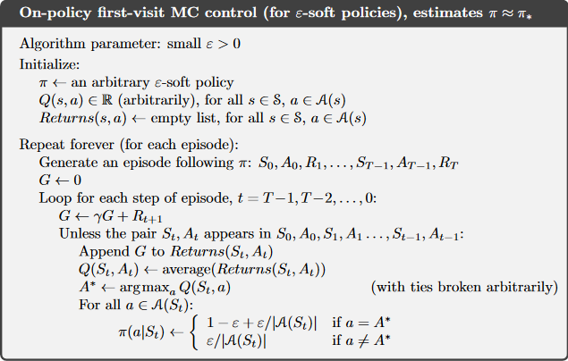

```
Felipe Rodriguez Atuesta
CMPUT 497 Project

Project Overview:  
The user is able to train a program to play tic-tac-toe using a reinforcement learning algorithm. 
After the training is completed, the user can play against the program or watch it play against itself.

How To Play:
1- Compile and run file "project.cpp"
2- First need to train the program: Input the number of simulations the program will perform during training 
   (roughly speaking the bigger the number the stronger the program). 100000 or more are recommended
3- follow the menu and instructions 


High Level Overview (see comments in the code for more details):
The program learns position (move) values by simulating games. When a game finishes, it updates the
value of each position seen during the game based on the final result. It uses a modified version of 
the following algorith:
```


    Reinforcement Learning - Sutton and Barto, Second Ed. Page 101

```
Setup:
  - The state/action pair "Q(s, a)" is combined to simply the state that results after making a move
  - "Returns(s, a)" are pairs [# of wins, # of times played] of a position
  - The value of a position is equal # of wins / # of times played 
  - The policy is simply select the legal move (position) with the highest value
  - Epsilon is set to 10 (explores 0.1 and exploits 0.9)
  - Positions are initialized to 1 to encourage selection of unseen positions
  - At the end of the game, simply update the value of each position seen 
```
